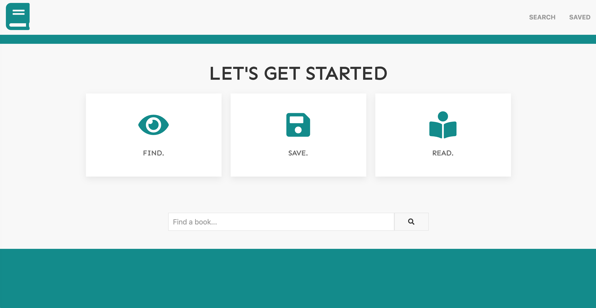
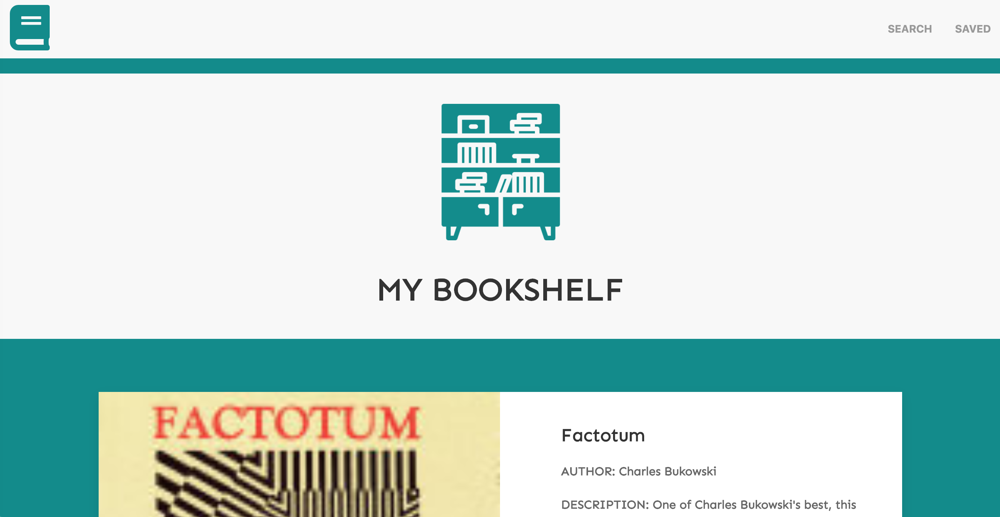

# I'm Already Booked

## Take Me There: [📖](https://imalreadybooked.herokuapp.com/)

* A full-stack application for building a book library. 

* Users can search for new titles, preview via Google Books, save entries to read and delete once they're done. 

## Getting Started

1. From your terminal, navigate to the directory that you would like to clone the repository into.

2. Clone this repo to your local machine using 
```
git clone git@github.com:hkennedyvi/google-books.git
```
3. While at the root level of the repo, install the dependencies with `npm install`

4. Run the application using `npm start`

## Built With:

* [React](https://reactjs.org/) - The web framework used
* [UI-Kit](https://getuikit.com/) - The style framework used
* [GoogleBooksAPI](https://developers.google.com/books) - The API used for book data

## How it Looks:

 

## Authors

* **Howard Kennedy** 